# 🥋 BJJ Fund — Plataforma de Crowdfunding para Atletas de Jiu-Jitsu

A maior plataforma brasileira criada para conectar **atletas de jiu-jitsu** a **apoiadores reais**.  
Aqui, sonhos se transformam em conquistas por meio de um sistema transparente de **doações**, **campanhas**, **dashboards inteligentes** e autenticação segura.

---

# 🔥 Badges


---

# 📸 Preview da Aplicação

## 🏠 Tela Inicial

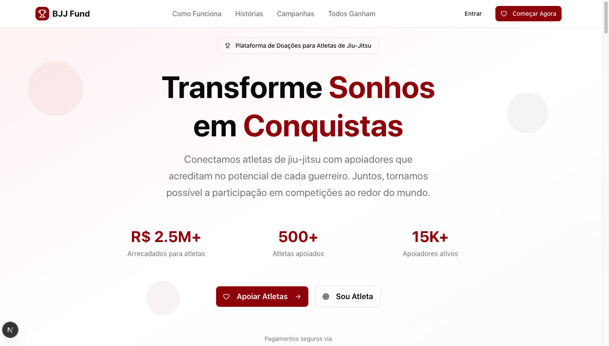

## ✨ Seções da Landing Page

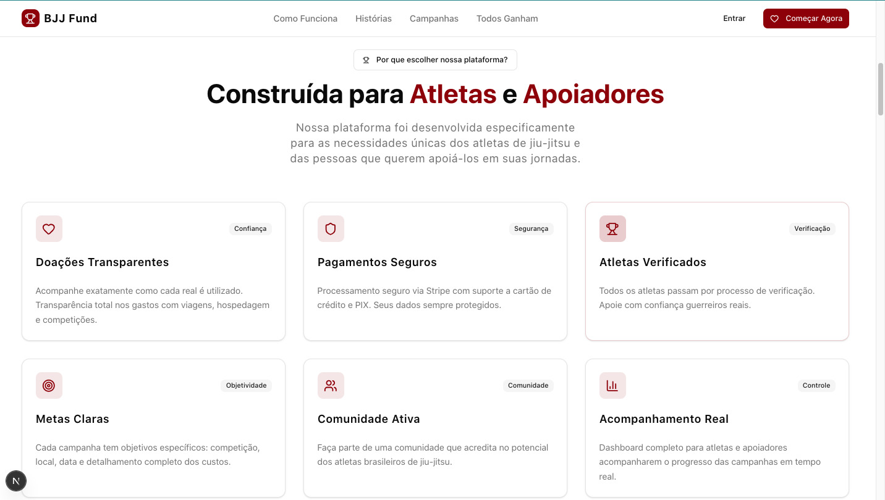
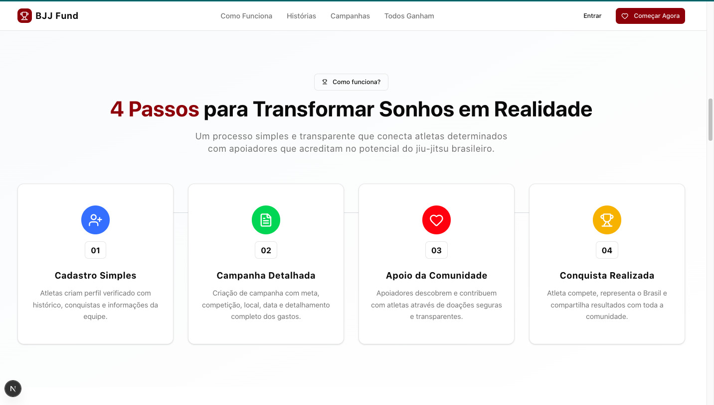
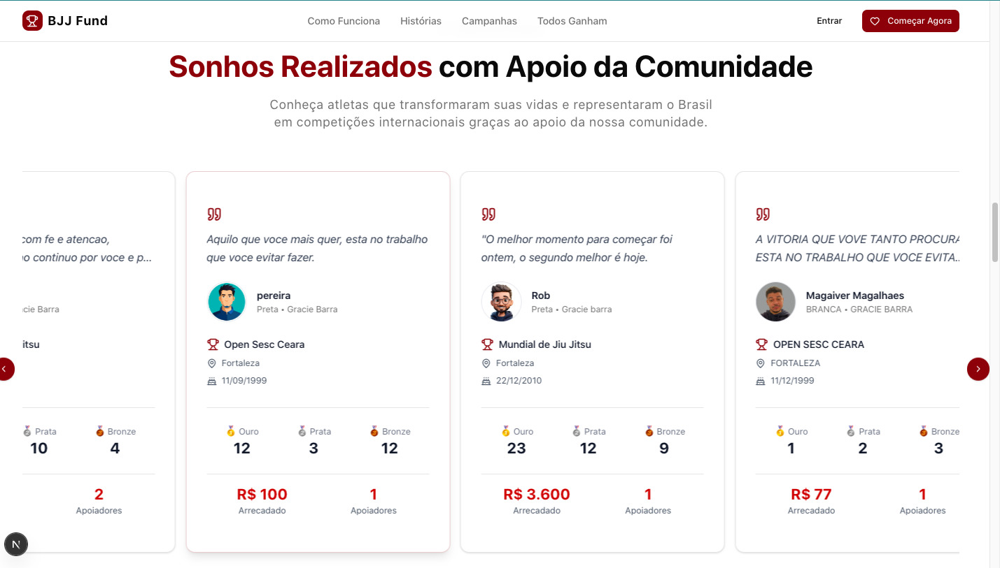
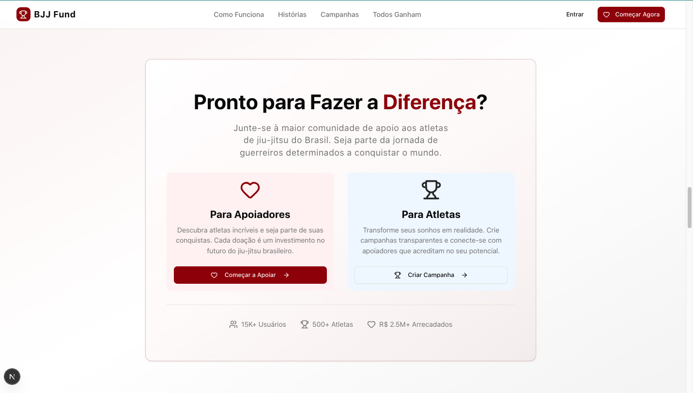
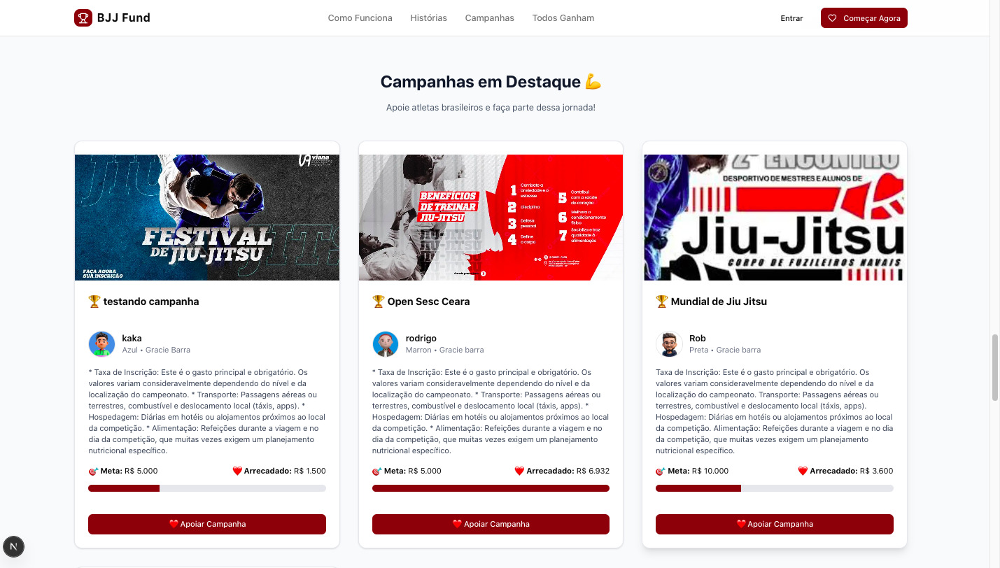
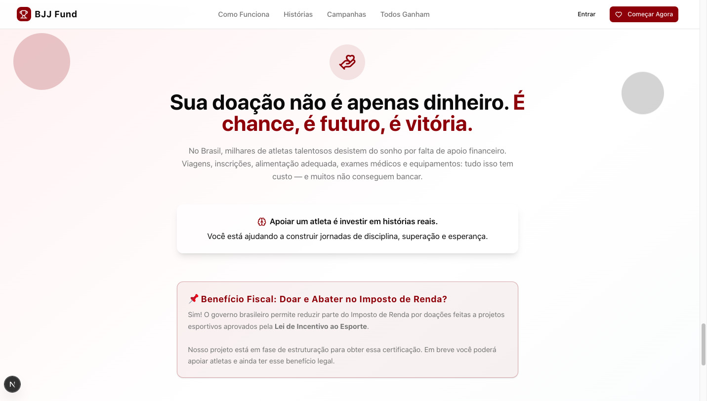
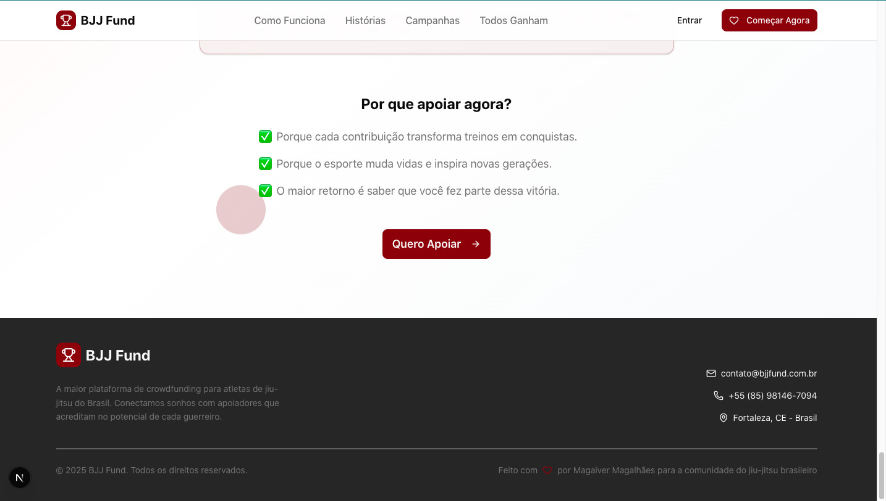

## 🔐 Autenticação

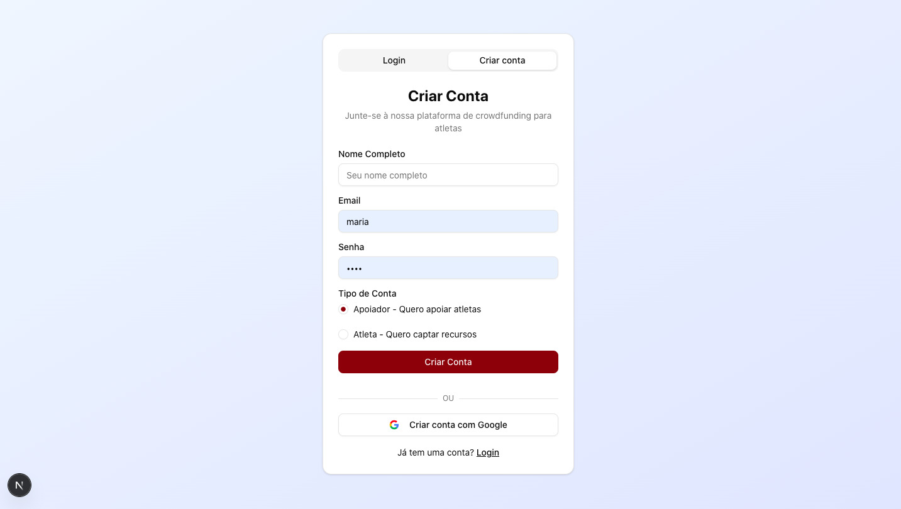
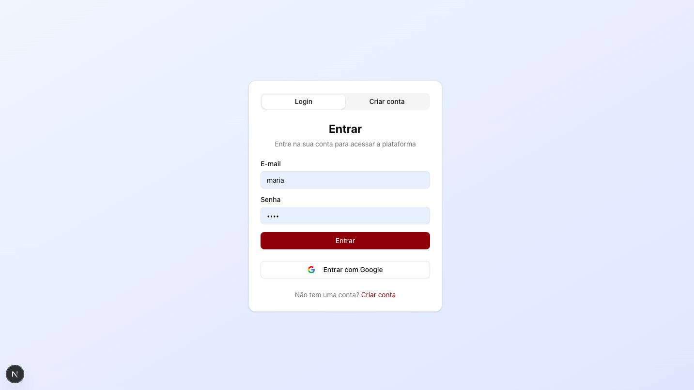

## 🧑‍🦽 Dashboard do Atleta

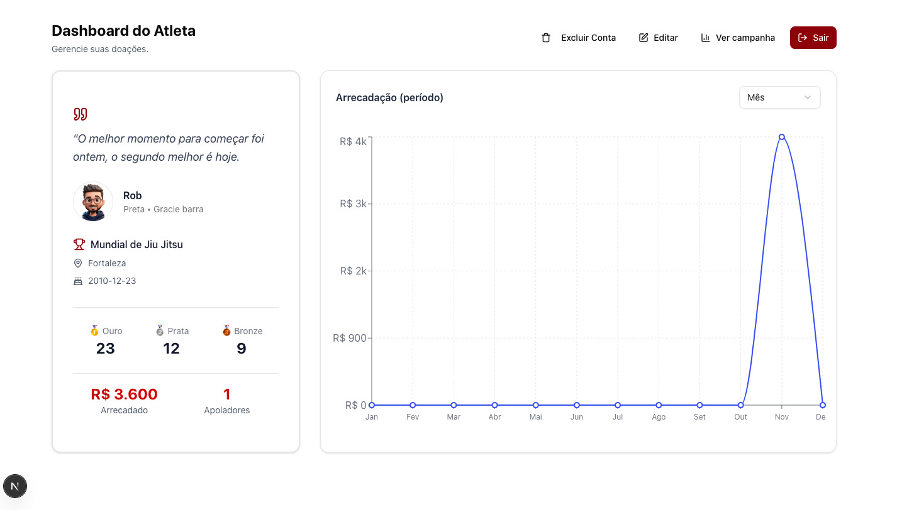

---

# 🧠 Objetivo do Projeto

O **BJJ Fund** nasceu com a missão de apoiar atletas do jiu-jitsu brasileiro que deixam de competir por falta de recursos.  
A plataforma conecta:

- **Apoiadores:** pessoas que desejam investir em sonhos reais.
- **Atletas:** competidores que precisam de ajuda com viagens, inscrições e estrutura.

O resultado?  
**Treinos viram conquistas.**  
**Conquistas viram inspiração.**

---

# 🏗️ Arquitetura da Aplicação

```
bjj-fund/
│
├── src/
│   ├── app/
│   │   ├── landing/
│   │   ├── authentication/
│   │   ├── dash-athletes/
│   │   ├── dash-donors/
│   │   ├── create-campaigns/
│   │   ├── api/
│   │   │   ├── auth/[...all]
│   │   │   ├── check-user-exists/
│   │   │   ├── select-role/
│   │   │   ├── metrics/
│   │   │   ├── stripe/webhook/
│   │   └── google-callback/
│   │
│   ├── components/
│   ├── lib/
│   ├── db/
│   └── utils/
│
├── public/
│   ├── readme/
│   └── favicon.ico
│
└── README.md
```

---

# 🧩 Tecnologias Utilizadas

## **Frontend**

- Next.js 15
- React 19
- Tailwind CSS 4
- Shadcn/UI
- Framer Motion

## **Backend**

- Next.js Route Handlers
- Better Auth

## **Pagamentos**

- Stripe Checkout
- Stripe Webhooks

## **Banco de Dados**

- PostgreSQL
- Drizzle ORM
- Drizzle Kit

## **Outros**

- Lucide Icons
- React Hook Form
- Zod
- Sonner Toasts

---

# 🔐 Fluxo de Autenticação (Better Auth)

```
[Login/Register] → /api/auth
        |
        |— Valida email/senha
        |— Login social (Google)
        |
        |— Cria sessão segura (JWT + Cookies HttpOnly)
        |
        → Redireciona baseado na role:
             - admin → /dashboard
             - athlete → /dash-athletes
             - supporter → /dash-donors
```

### Recursos implementados:

- Login
- Cadastro
- Login com Google
- Callback Google com verificação de conta existente
- Diferenciação por **roles**
- Tipagem avançada com **ExtendedSession**

---

# 💳 Fluxo de Doações (Stripe + Webhook)

```
[Usuário escolhe valor]
          ↓
createCheckoutSession()
          ↓
Stripe Checkout
          ↓
Pagamento aprovado
          ↓
Webhook (servidor)
          ↓
Validação + Inserção em donations
          ↓
Métricas atualizadas no dashboard
```

### Implementações:

- Pagamentos reais via Stripe
- Webhook seguro com `constructEvent`
- Prevenção de duplicidade
- Doações com ou sem campanha
- Persistência completa no banco

---

# 📊 Dashboards

## 🥋 Dashboard do Atleta

- Arrecadação mensal
- Métricas gerais
- Conquistas (ouro, prata, bronze)
- Visualização da campanha
- Acesso ao modo de edição
- Lista de apoiadores

## ❤️ Dashboard do Apoiador

- Lista de atletas apoiados
- Atalhos para apoiar novamente
- Recomendações personalizadas
- Acompanhamento de campanhas

---

# 🗄️ Banco de Dados (Drizzle ORM + PostgreSQL)

Modelos presentes:

- **User**
- **Sessions / Accounts**
- **Profiles**
- **Athletes**
- **Competitions**
- **Campaigns**
- **Campaign Items**
- **Donations**
- **Transactions**
- **AthleteDonors**
- **Metrics**
- **AthleteMetrics**
- **CampaignMetrics**

### Cada tabela possui:

- Foreign Keys
- Cascade deletes
- Índices
- Valores default
- Uso de JSONB quando necessário

---

# 📡 APIs Implementadas

### **/api/check-user-exists**

Verifica se o usuário Google já possui conta.

### **/api/select-role**

Atribui a role (athlete/supporter).

### **/api/metrics/donations**

Retorna estatísticas globais.

### **/api/stripe/webhook**

Recebe confirmações da Stripe e salva no DB.

### **/api/auth/**

Toda stack Better Auth implementada.

---

# ⚙️ Instalação e Execução

### **1) Clonar projeto**

```bash
git clone https://github.com/seu-usuario/bjj-fund.git
cd bjj-fund
```

### **2) Instalar dependências**

```bash
npm install
```

### **3) Criar arquivo `.env.local`**

```
DATABASE_URL="postgres://..."
STRIPE_SECRET_KEY="..."
STRIPE_WEBHOOK_SECRET="..."
GOOGLE_CLIENT_ID="..."
GOOGLE_CLIENT_SECRET="..."
NEXT_PUBLIC_APP_URL="http://localhost:3000"
```

### **4) Rodar migrações**

```bash
npx drizzle-kit push
```

### **5) Rodar servidor**

```bash
npm run dev
```

---

# 🧪 Scripts Disponíveis

```json
"dev": "next dev",
"build": "next build",
"start": "next start",
"lint": "next lint"
```

---

# 🧭 Filosofia e Impacto do Projeto

O **BJJ Fund** nasceu para mudar vidas.

Acreditamos que:

- o jiu-jitsu transforma pessoas
- atletas brasileiros têm nível mundial
- falta apenas **a ponte entre o sonho e a oportunidade**

Essa plataforma é essa ponte.

---

# 👤 Autor

**Carlos "Magaiver" Magalhães**  
Desenvolvedor Full Stack • Next.js • React • Tailwind • PostgreSQL • Stripe • Better Auth

🔗 Portfólio: https://my-portifolio-three-navy.vercel.app/
🔗 LinkedIn: https://www.linkedin.com/in/magaiver-magalhaes-bb9572234  
🐙 GitHub: https://www.github.com/MAGAIVERH

---

# ⭐ Contribuições

Pull Requests são bem-vindos!

---

# 📜 Licença

Este projeto está sob licença **MIT**.
